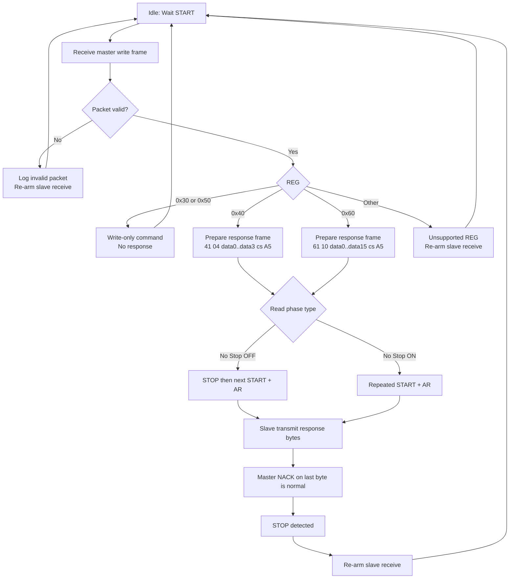

# Sample_Project_RH850_S1_RIIC_I2C_Slave

Update: 2026-04-23

## 1. Project Summary

- Board: `Y-BLDC-SK-RH850F1KM-S1-V2`
- Role: `I2C Slave only` (`RIIC1`)
- Slave address: `0x70` (7-bit)
- Scope: This sample documents slave protocol/behavior only. Master demo flow is not part of this sample.

## 2. Runtime / Pin Mapping

- `TAUJ0_0`: 1 ms periodic interrupt
- `UART (RLIN3)`: TX=`P10_10`, RX=`P10_9`
- `LED`: `P0_14` and `P8_5` toggled every 1000 ms
- `RIIC1 (I2C Slave)`: SCL=`P8_1`, SDA=`P8_0`

## 3. Build Option (Slave Only)

- This project is fixed as slave-only application code.

## 4. Protocol Definition

### 4.1 Master Write Frame (custom protocol)

```text
HEAD  REG|W  LEN  DATA0 ... DATA(LEN-1)  CS  TAIL
5A    xx     xx   xx    ... xx           xx  A5
```

- `HEAD` = `0x5A`
- `TAIL` = `0xA5`
- `CS` = low 8-bit of sum: `REG + LEN + DATA...`

### 4.2 Slave Read Response Frame

```text
REG|R  LEN  DATA0 ... DATA(LEN-1)  CS  TAIL
xx     xx   xx    ... xx           xx  A5
```

- Response frame does not include `HEAD`.
- `CS` = low 8-bit of sum: `REG|R + LEN + DATA...`

### 4.3 RX checksum verify option (Slave side)

- Define: `I2C_SLAVE_RX_CHECKSUM_ENABLE`
- Location: `I2C_slave_driver.h`
- `0`: checksum check disabled
- `1`: checksum check enabled
- Current default: `0`

## 5. Supported Registers

### 5.1 Write Only: `0x30`

- Master TX example (LEN=4):

```text
5A 30 04 data0 data1 data2 data3 cs A5
```

- Slave behavior: receive + parse + no read response.


### 5.2 Write Then Read: `0x40` -> `0x41`

- Master write phase:

```text
5A 40 00 cs A5
```

- Slave read response (8 bytes total):

```text
41 04 data0 data1 data2 data3 cs A5
```

- Tool read length must be `8`.


if master disable : NO STOP


if master enable : NO STOP


### 5.3 Write Only: `0x50`

- Master TX example (LEN=8):

```text
5A 50 08 data8 data9 data10 data11 data12 data13 data14 data15 cs A5
```

- Slave behavior: receive + parse + no read response.


### 5.4 Write Then Read: `0x60` -> `0x61`

- Master write phase:

```text
5A 60 00 cs A5
```

- Slave read response (20 bytes total):

```text
61 10 data0 data1 data2 ... data15 cs A5
```

- Tool read length must be `20`.


if master disable : NO STOP


if master enable : NO STOP


## 6. Stop-Start vs Repeated-Start

### 6.1 No Stop = OFF (Stop-Start)

```text
S + AW(0x70,W) + write frame + P
S + AR(0x70,R) + read response + NACK + P
```


### 6.2 No Stop = ON (Repeated-Start)

```text
S + AW(0x70,W) + write frame + Sr + AR(0x70,R) + read response + NACK + P
```


- Slave supports both modes.
- At read end, master NACK on last byte is normal.

## 7. Expected Slave Log

- Normal write-only:
  - `[S][RX] ...`
- Normal write-then-read:
  - `[S][RX] ...`
  - `[S][TX-READY] ...`
  - `[S] tx complete`
- `[S][EVT] ...` is intended for abnormal/event diagnostics only.


## 8. Slave Flow (Mermaid)


